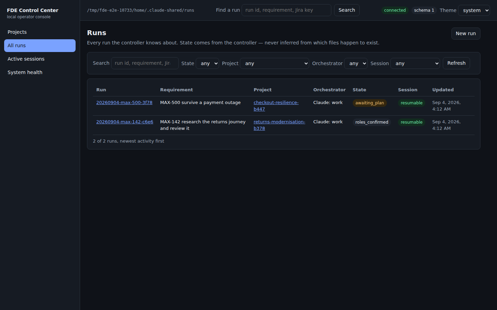
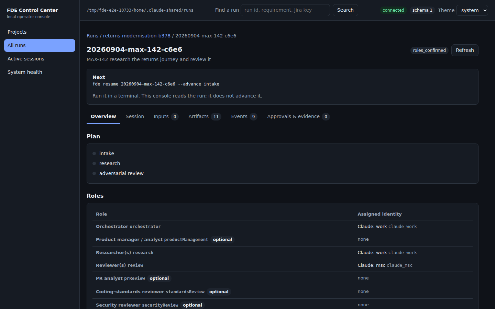
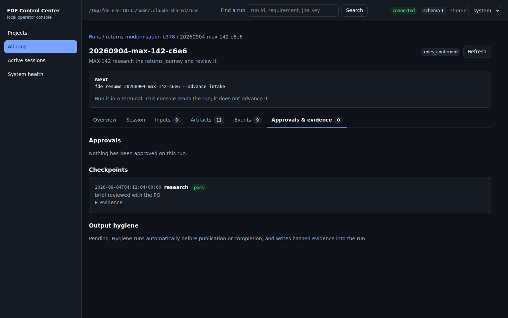
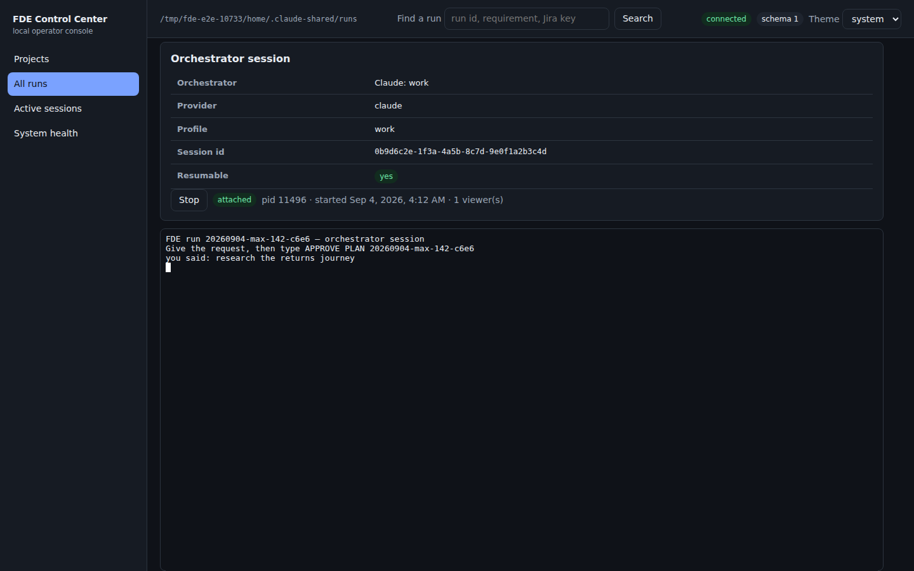
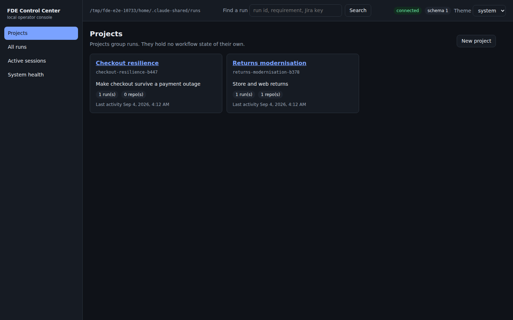
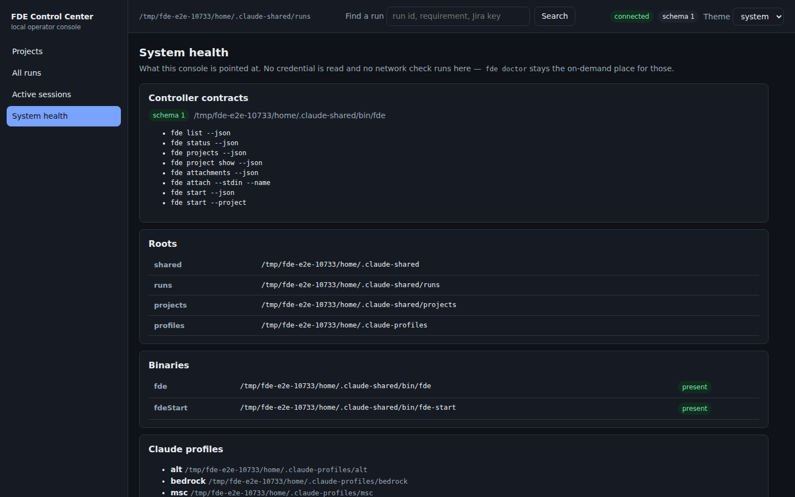
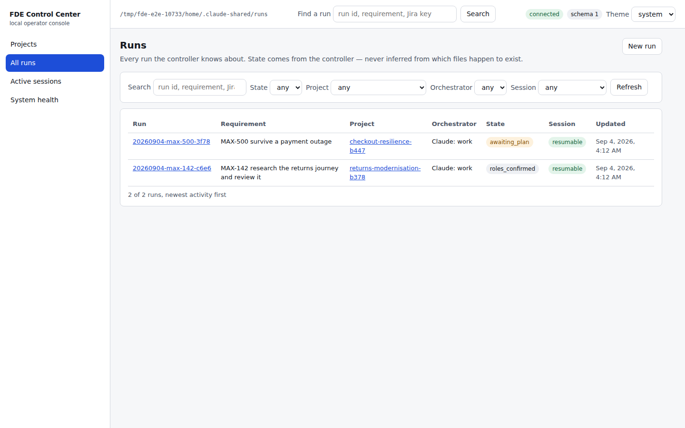

# FDE Control Center — operator guide

A local console over the `fde` controller. It shows you what your runs are
doing, lets you create projects and runs, attach input files, and resume a
Claude-led run in an embedded terminal.

It approves nothing. Roles, plan approval, Codex writes, deployment and
publication all stay where they were: typed by you, in a conversation or a
terminal. The console has no button for any of them and adds none.

## Start it

```bash
fde-gui
```

That builds the interface if it needs building, starts the server on
`127.0.0.1:7317`, and opens your browser. The link looks like:

```text
http://127.0.0.1:7317/#token=<a new token every launch>
```

The token rides in the URL fragment, which a browser never sends to a server —
so it stays out of request logs, `Referer` headers and history sync. It is valid
for that launch alone. Stop the console with Ctrl-C.

| | |
|---|---|
| `fde-gui --port 7400` | listen somewhere else |
| `fde-gui --no-open` | start without opening a browser |
| `fde-gui --rebuild` | rebuild the interface |
| `fde-gui --install` | reinstall dependencies first |

## The screens

### Runs

Every run the controller knows about, newest activity first. Search by run id,
requirement or Jira key; filter by state, project, orchestrator or whether a
session can be resumed. A run's state comes from the controller — the console
never decides a run is finished because a file appeared.



### Run detail

The header carries the run id, its project, the requirement and the state. The
**Next** panel shows the controller's own next step, to run in a terminal.



Six tabs:

- **Overview** — the plan as a stage timeline, the roles with the identity
  holding each, and the raw manifest behind a disclosure.
- **Session** — whether this run can be resumed, and the terminal if it can.
- **Inputs** — attachments with their size and SHA-256, and the input files.
- **Artifacts** — what the plan expects, what exists, and a file browser with
  previews.
- **Events** — the run log, paginated, with each record's raw JSON available.
- **Approvals & evidence** — approvals with their status, checkpoints with their
  evidence, and the output-hygiene report.



### Resuming a run

For a Claude-led run, **Resume session** starts exactly
`fde-start --resume <run-id>` and streams it into the page. You type into it as
you would in a terminal — including the approval phrases, which are yours to
type.



One process per run: a second tab attaches to the same session rather than
starting another. Closing the tab detaches; it does not stop the run. **Stop**
sends an interrupt, and a **Force stop** appears a few seconds later if the
session is still there — behind a confirmation.

A Codex-led run says so instead of offering a button: it is driven from its own
Codex task, and the console will not pretend otherwise.

### Attaching a file

On the Inputs tab, pick a file and press Attach. The bytes go to
`fde attach --stdin --name`, so the controller — not the console — sanitizes the
filename, generates the stored name, hashes what it wrote and appends the audit
record. Your original is copied, never moved or changed.

### Projects

Projects group runs. A project is a name, a description and repository paths
that must already exist; it holds no workflow state. Nothing here clones,
changes or deletes a repository.



### Active sessions and system health

**Active sessions** lists what this console has started. A session you started in
your own terminal is not listed — it belongs to that terminal.

**System health** shows the roots the console is pointed at, whether `fde` and
`fde-start` are present, the contracts the installed controller speaks, and the
names of your Claude profiles. No credential is opened, and no network or
Keychain check runs here.



## Themes and keyboard

The console follows your machine's light or dark setting; the **Theme** control
in the top bar overrides it for this browser. Every screen passes an automated
WCAG 2.1 AA audit, contrast included, in both themes. Tab reaches a skip link
first; the run tabs move with the arrow keys, Home and End.



## When something looks wrong

| What you see | What it means | What to do |
|---|---|---|
| *The installed controller is older than this console* | `~/.claude-shared/bin/fde` predates the JSON contracts | `./install.sh --update` from your fde-setup checkout |
| *This installation has no terminal backend* | `node-pty` did not build here | `fde-start --resume <run-id>` in a terminal; reinstall dependencies to fix it |
| *Resume this run in its original Codex task* | the run is Codex-led | drive it from Codex; the console can still show its state and files |
| *The controller refused this request* | a controller gate or a bad input | the message is the controller's own; fix what it names |
| *This run is busy* | another change is in flight for it | refresh and try again |
| *N things in this data could not be read cleanly* | a malformed or half-written record | the rest of the run still renders; the file on disk is untouched |
| A red banner across every screen | the console cannot talk to the controller at all | check System health for the path it is using |

## Where things live

| | |
|---|---|
| The console | `~/.claude-shared/fde-gui` |
| Runs | `~/.claude-shared/runs/<run-id>` |
| Projects | `~/.claude-shared/projects/<project-id>` |
| The launcher | `~/.claude-shared/bin/fde-gui` |

The console reads and writes nothing itself: every change goes through an `fde`
command, and every fact on screen came from one. If the console is not running,
nothing about your runs changes.
